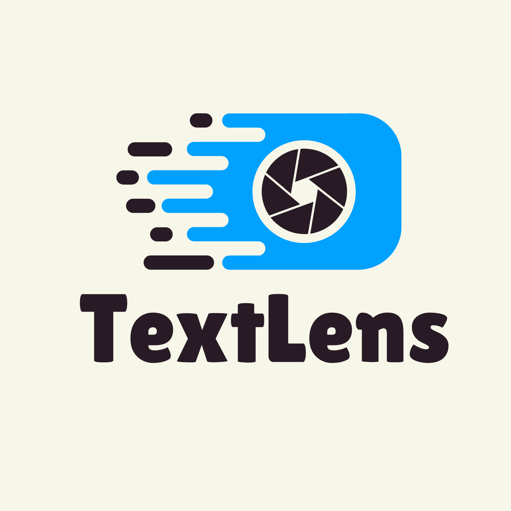

<p align="center">
  
</p>

# TextLens

**Local OCR for Python developers, built around modern vision-language models (VLMs).**

TextLens makes local OCR reusable: initialise an OCR client, give it an image or PDF, and receive text. It also provides model discovery and caching, CUDA diagnostics, a REST API, and BatchOCR for processing document folders with exports and live progress.

> **Early release notice.** TextLens is designed primarily for NVIDIA CUDA GPUs. Most supported engines are VLMs, so an NVIDIA RTX/CUDA-capable GPU is strongly recommended for practical local OCR. CPU fallback exists but is much slower for large documents and batches. Apple Silicon / MPS optimisation is under active investigation and is **not a supported acceleration target yet**.

## Why TextLens?

OCR projects repeatedly need the same work: choose a capable model, download it, prepare images and PDFs, select a device, write prompts, manage batch failures, and save usable output. TextLens packages that work behind a Python-first API so the OCR code can stay small, readable, and reusable.

## Supported models

The registry currently exposes four locally downloadable VLM/OCR models:

| ID | Model | Intended use | Recommended GPU memory |
| --- | --- | --- | --- |
| `glm-ocr` | GLM OCR (default) | General document OCR, tables, formulas | 6 GB VRAM |
| `lighton-ocr` | LightOnOCR | Academic and multilingual documents | 8 GB VRAM |
| `hunyuan-ocr` | HunyuanOCR | Complex layouts, charts, and structured extraction | 8 GB VRAM |
| `smolvlm` | SmolVLM-256M | Laptops, edge devices, and low-VRAM use | 2 GB VRAM |

Inspect the live catalog on your machine with `textlens models` or `ModelManager.models()`.

## Install

TextLens requires Python 3.9+. Current PyTorch stable releases may require Python 3.10+, so use Python 3.10+ for the smoothest GPU installation.

```bash
git clone https://github.com/Srevarshan05/textlens.git
cd textlens
python -m venv .venv
```

Activate the environment:

```powershell
# Windows PowerShell
.\.venv\Scripts\Activate.ps1
```

```bash
# macOS/Linux
source .venv/bin/activate
```

Then install the CUDA-enabled PyTorch build first (next section), followed by TextLens:

```bash
python -m pip install --upgrade pip
python -m pip install -e .
```

## NVIDIA CUDA setup (Windows and Linux)

You need an NVIDIA GPU and a recent NVIDIA graphics driver. For normal TextLens use, you generally **do not need to install the full CUDA Toolkit**: PyTorch's CUDA wheel includes the CUDA runtime it needs. Install the toolkit only if you are compiling CUDA software yourself.

1. Check that Windows/Linux can see your GPU:

   ```bash
   nvidia-smi
   ```

   If this command is missing or errors, install or update the driver from [NVIDIA Drivers](https://www.nvidia.com/en-us/drivers/), restart, and run it again.

2. In the activated virtual environment, use the command currently shown by the [official PyTorch installer selector](https://pytorch.org/get-started/locally/) for your OS, Python, Pip, and CUDA platform. For example, the CUDA 12.8 wheel is:

   ```bash
   python -m pip install torch torchvision torchaudio --index-url https://download.pytorch.org/whl/cu128
   ```

   Choose `cu118`, `cu126`, or `cu128` only when that is what the official selector recommends for your driver/platform. Do not mix a CPU-only PyTorch package with a CUDA wheel in the same environment.

3. Install TextLens:

   ```bash
   python -m pip install -e .
   ```

4. Verify both PyTorch and TextLens:

   ```bash
   python -c "import torch; print(torch.__version__); print('CUDA:', torch.cuda.is_available()); print('GPU:', torch.cuda.get_device_name(0) if torch.cuda.is_available() else 'not available')"
   textlens doctor
   ```

`CUDA: True` means PyTorch can accelerate TextLens. If an NVIDIA GPU is present but this prints `False`, run `textlens doctor`; it reports the detected driver and a suggested PyTorch command. The authoritative PyTorch instructions are linked above because supported CUDA wheel versions change over time.

## Quick start: modern API

The `OCR` API is the recommended registry-based interface. It downloads a registered model the first time it is needed, then lazy-loads it on the first `read()` call.

```python
from textlens import OCR

ocr = OCR(model="glm-ocr")       # default model; downloads if missing
text = ocr.read("invoice.png")
print(text)
```

Use a different model or device:

```python
ocr = OCR(model="smolvlm", device="cuda")
text = ocr.read("scan.jpg", prompt="Read every visible word.", max_new_tokens=1024)
```

`OCR.read()` accepts a local image/PDF path, HTTP(S) URL, Pillow image, `bytes`, or `BytesIO`. PDFs return a single string with `--- Page N ---` separators.

## Legacy SDK: richer GLM-OCR helpers

`TextLens` remains supported for its GLM-OCR-specific helpers. Use `auto_load=False` when you want construction without immediately loading the model.

```python
from textlens import TextLens

engine = TextLens(auto_load=False)
engine.load()

print(engine.read("invoice.png"))
print(engine.extract_table("table.png"))
print(engine.extract_formula("equation.png"))
print(engine.extract_json("receipt.jpg", schema='{"vendor": "str", "total": "float"}'))

for page in engine.read_pdf("contract.pdf", max_pages=3):
    print(page["page"], page["text"])
```

## BatchOCR

`BatchOCR` scans a folder (or accepts a list of files), queues supported images/PDFs, retries failures, writes one output per document, and writes a `batch_manifest.json` summary. Supported inputs: PDF, PNG, JPG/JPEG, WEBP, BMP, TIFF/TIF.

```python
from textlens.batch import BatchOCR, TaskStatus

batch = BatchOCR(
    model="glm-ocr",
    workers=2,                  # start small: each worker can consume GPU memory
    output_dir="./results",
    output_format="json",      # json | markdown | csv | txt
    retries=2,
    enable_dashboard=False,
)

tasks = batch.run("./documents")
for task in tasks:
    if task.status is TaskStatus.COMPLETED:
        print(task.source_path.name, task.output_path)
    else:
        print(task.source_path.name, task.error)
```

Set `enable_dashboard=True` to launch the local dashboard (default `http://127.0.0.1:8765`). On a GPU, do not increase `workers` blindly: parallel VLM inference can exhaust VRAM. Begin with one or two workers and increase only after checking `textlens doctor` and real memory use.

```python
# These controls can be called from another thread or your application UI.
batch.pause()
batch.resume()
batch.cancel()
batch.retry_failed()
batch.reconfigure(workers=2, output_format="markdown", retries=3)
```

## Model management and hardware inspection

```python
from textlens import ModelManager
from textlens.models import HardwareDoctor

ModelManager.models()
ModelManager.download("smolvlm")
metadata = ModelManager.info("smolvlm")

report = HardwareDoctor().run()
HardwareDoctor().print_report(report)
```

## REST API

```python
import textlens

textlens.serve(host="127.0.0.1", port=8000)
```

Open `http://127.0.0.1:8000/docs` for Swagger UI. Available endpoints include `GET /api/v1/health`, `GET /api/v1/hardware`, `POST /api/v1/ocr` (file upload or form path/URL), and `POST /api/v1/ocr/json-payload` (JSON URL/path).

## CLI

```bash
textlens models
textlens model install smolvlm
textlens model info glm-ocr
textlens doctor
textlens read document.png --device cuda
textlens batch ./documents --model glm-ocr --workers 2 --format markdown --no-dashboard
textlens serve --port 8000
```

## Test before using a model

The standard suite is offline and mocks downloads/model inference where appropriate:

```bash
python -m pytest tests -q
python scripts/run_feature_checks.py
```

For a real, local inference check after downloading a model, supply an image:

```bash
python scripts/run_feature_checks.py --image ./test-image-ocr.png --model glm-ocr --device cuda
```

See [the API reference](docs/API_REFERENCE.md) for public classes, functions, parameters, return values, and the full test checklist.

## Runnable examples

The [examples](examples/README.md) directory contains separate scripts for environment setup, model management, image/PDF OCR, custom prompts, table/formula/JSON extraction, device switching, BatchOCR, and the REST API. Start with:

```bash
python examples/00_environment_check.py
python examples/02_basic_ocr.py ./test-image-ocr.png --model smolvlm --device cuda
```

## Status and roadmap

TextLens is an initial local-first release. NVIDIA CUDA is the recommended acceleration path today. CPU mode is a fallback, not the target for high-throughput OCR. Apple Silicon MPS support and strategies for optimising OCR workloads on Apple chips are planned future work; they should not yet be treated as production-ready support.

## License

MIT License © TextLens Contributors.
